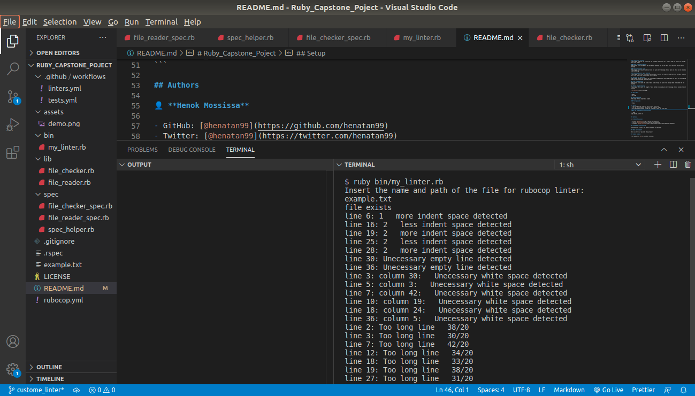

# Ruby_Capstone_Poject
This a Ruby Capstone project from the Microverse Ruby curriculum. The purpose of this project is to build a custom linter program for the documentation of a specific file type. 

## Description 
This custom linter program is developed to catch standard documentation offenses of ruby files. 

### Indentation Offenses
The program compares the actual and the standard indentation of a line in code and puts an error message with line number 

### Empty line before a method
The program will look before the new method opening tag and if there is no newline it puts an error message

### Unecessary empty line
The program will loop through each line and gives an error message when it gets one which is not before a new method tag

### Unnecessary white space detected
The program will catch unnecessary white space in a line and loops through each line and give comments with line number and column number information

## Unclosed tag detection
The program checks for balance of line standard indentation level and checks if there is an unclosed tab and puts error message when one founds

## line size detection
The program will count the size of each line strings and puts an error message when it exceeds the set maximum

## Method length detection
The program will count the length of each method blocks and puts an error message when it exceeds the set maximum 
 

 
## Built With

- Ruby
- VS code

## Getting Started
The usage of this program is simple. 

### Prerequisites

- Ruby

## Setup
- copy the program folder in your project directory
- run the user interface 'my_linter.rb' from the bin folder 
- Once the message displayed asking the file name, input the file name

**Run the code demonstrations below**

```bash
ruby bin/my_linter.rb 
```

## Authors

👤 **Henok Mossissa**

- GitHub: [@henatan99](https://github.com/henatan99)
- Twitter: [@henatan99](https://twitter.com/henatan99)
- LinkedIn: [Henok Mossissa](https://www.linkedin.com/in/henok-mekonnen-2a251613/)

## :handshake: Contributing

Contributions, issues, and feature requests are welcome!

## Show your support

Give a :star:️ if you like this project!

## :memo: License

This project is [MIT](./LICENSE) licensed.
